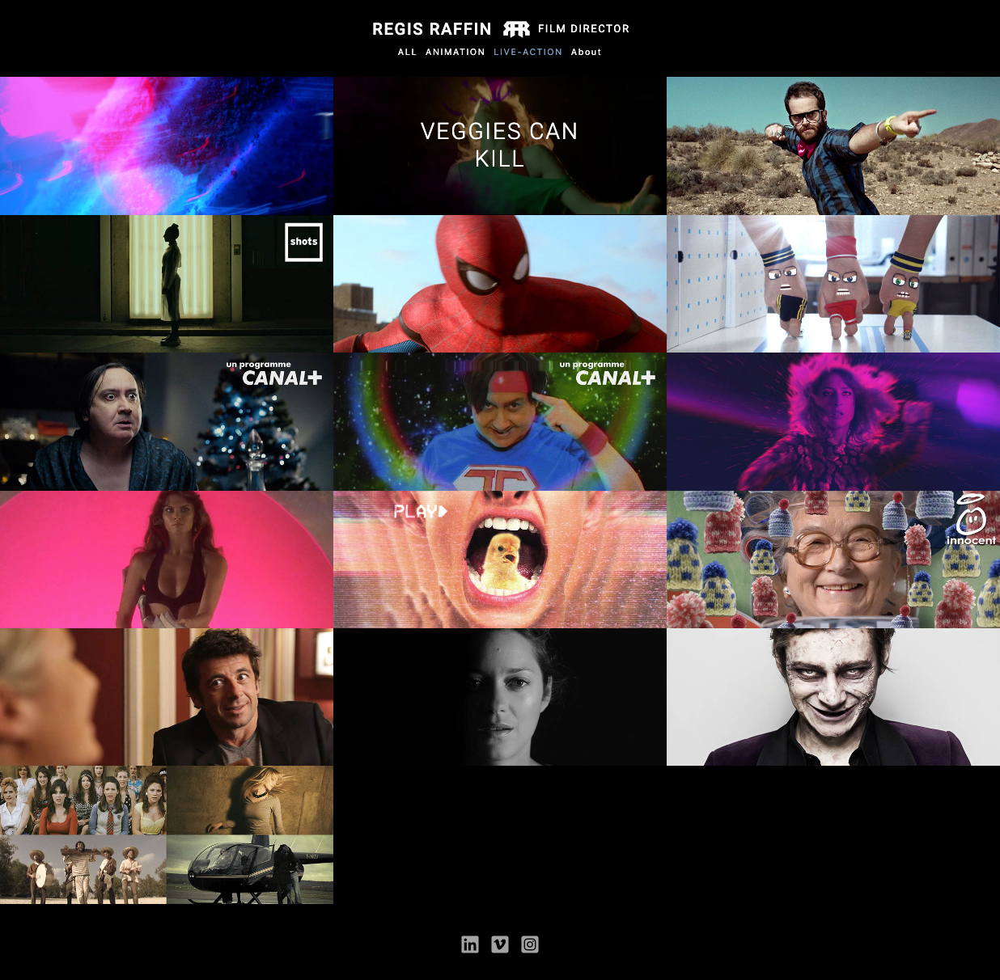
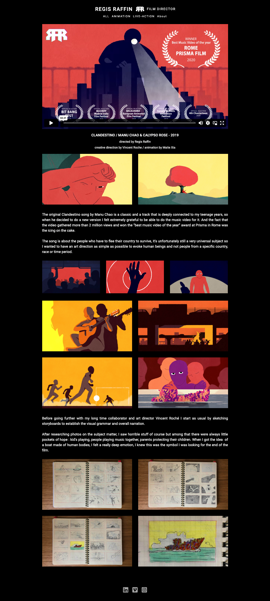
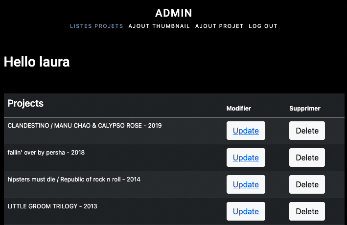
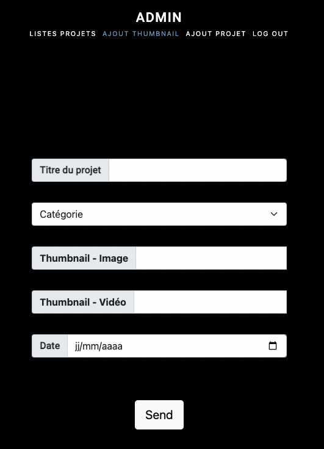
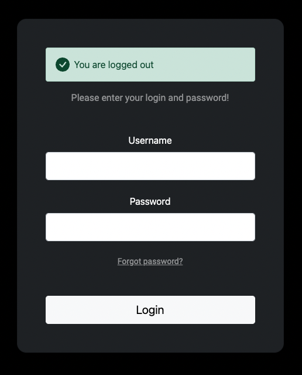
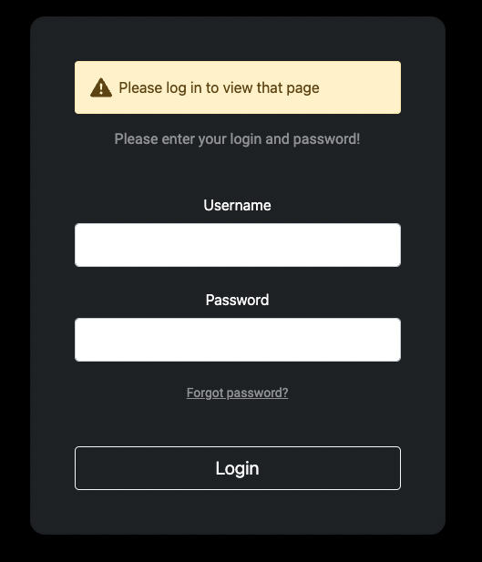

# PORTFOLIO WEBSITE WITH ADMIN PANEL

## SITE PREVIEW (under construction)

(https://mysterious-taiga-64071.herokuapp.com/).

## Built with

* NODEJS, EXPRESS, MONGOOSE
* HTML, CSS, BOOTSTRAP 5, EJS

## Purpose

Each time the owner wants to add a project to his portfolio, he can create the thumbnail for the homepage, and a linked page where he 
adds videos (vimeo links), images (aws s3 files) and texts all stored in a MongoDb database.
He can classify his projects by category, update them.

### What I've learned / reviewed

* EJS 
* Secured admin panel | User registration, password hash, User authentification, secured routes, login, logout | (passport.js, bcryptjs)
* Dotenv for environment variables
* CRUD operations 
* Mongoose 

### Screenshots

