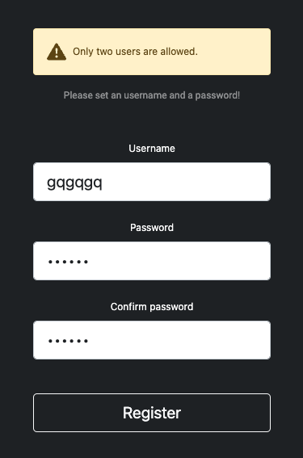

# PORTFOLIO WEBSITE WITH A CONTENT MANAGEMENT SYSTEM

## Live site

(https://www.regisraffin.com/).

## Built with

- Backend : Nodejs & Expressjs, MongoDB & Mongoose
- Frontend : html, css, bootstrap 5, ejs, javaScript

### What I've learned or reviewed

- EJS
- Secured admin panel | User registration, password hash, User authentification, secured routes, login, logout | (passport.js, bcryptjs)
- Dotenv for environment variables
- CRUD operations
- Mongoose ORM with NoSQL database MongoDB
- Asynchronous JS with async await keywords
- JSDoc
- AWS : S3 bucket policies - Host on Amazon Lightsail, use of nano editor, server protection (fail2ban, logwatch...)

### To do / improve :

- Cache-control, Page loading speed
- Helmet library config / csp
- express-mongo-sanitize library or express-validator, sanitize-html

### Updated :

- Do not allow more than two Users in db
- instance security

### Screenshots

