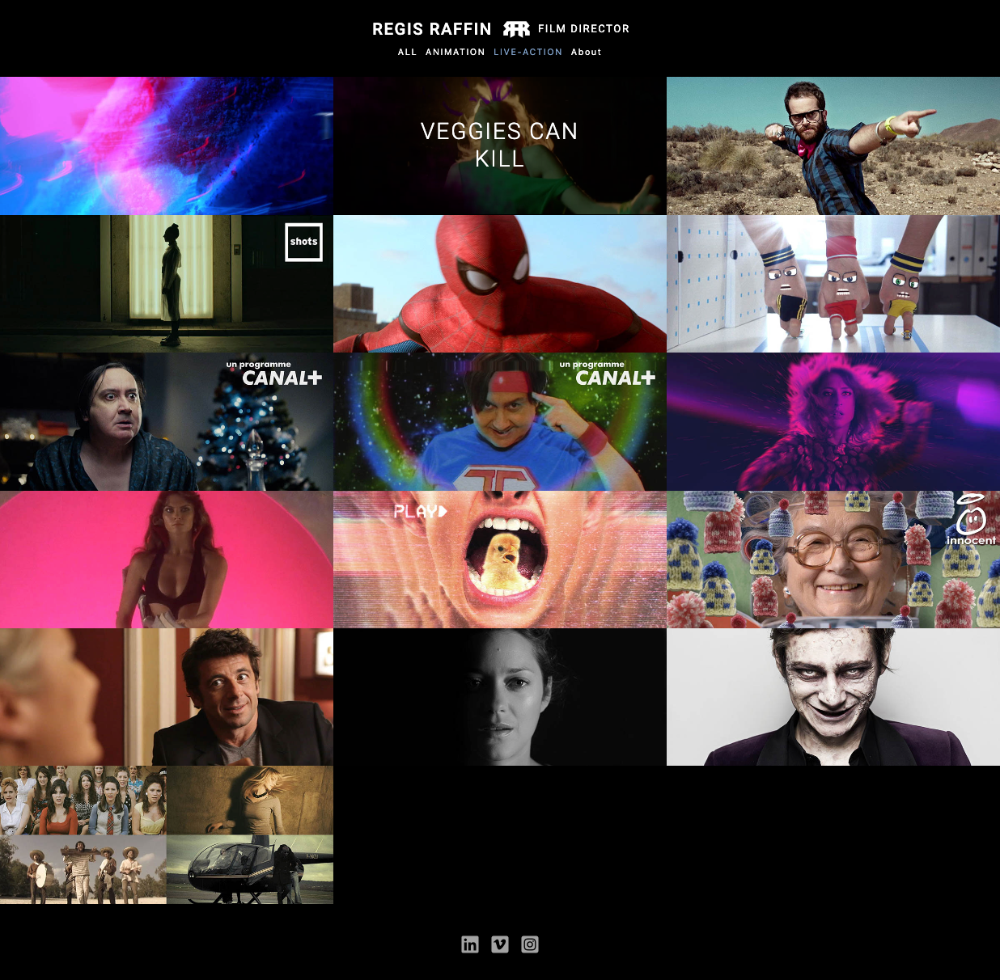
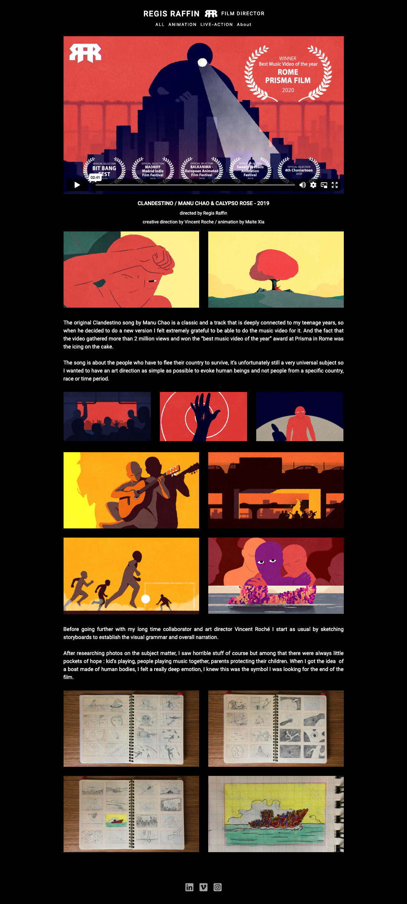
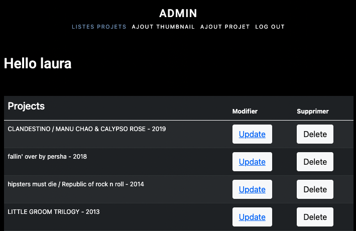
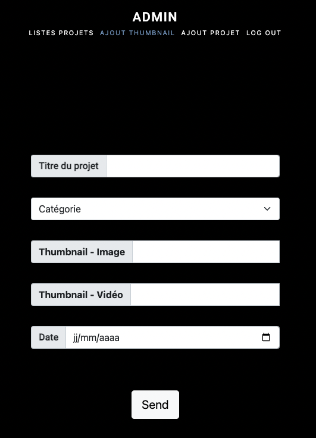
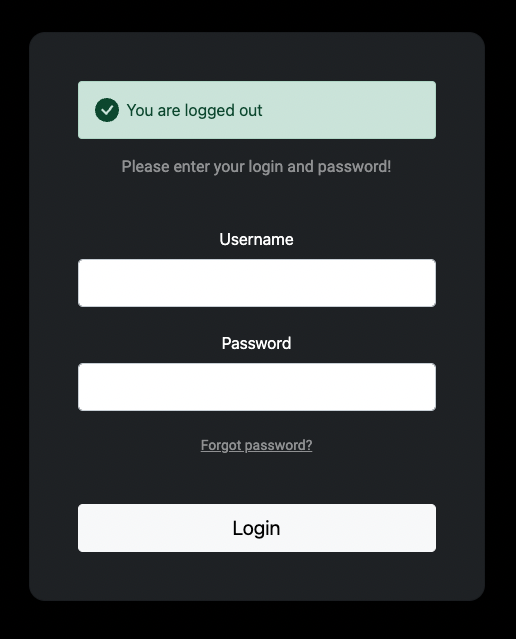
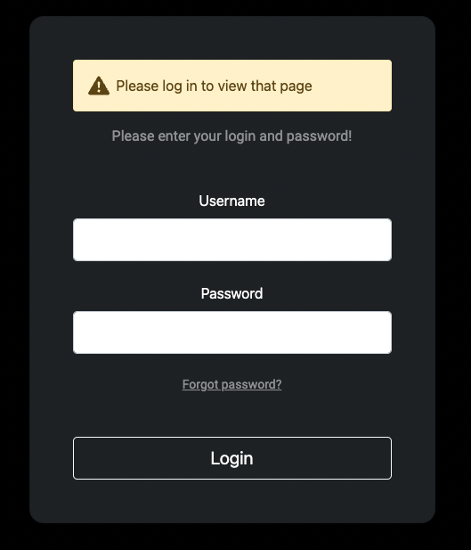
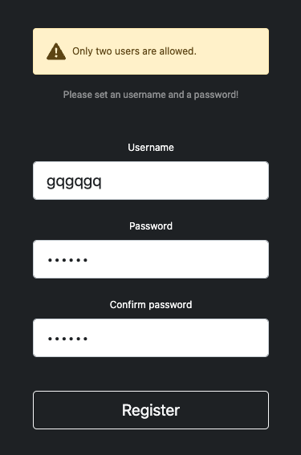

# PORTFOLIO WEBSITE WITH A CONTENT MANAGEMENT SYSTEM

## Live site

(https://www.regisraffin.com/).

## Built with

- Backend : Nodejs & Expressjs, MongoDB & Mongoose
- Frontend : html, css, bootstrap 5, ejs, javaScript

### What I've learned or reviewed

- EJS
- Secured admin panel | User registration, password hash, User authentification, secured routes, login, logout | (passport.js, bcryptjs)
- Dotenv for environment variables
- CRUD operations
- Mongoose ORM with NoSQL database MongoDB
- Asynchronous JS
- Security of ExpressJs apps (helmet, express-validator...)
- AWS services (lightsail, s3, Cloudfront)
- Debian VPS | fail2ban, ufw, snort, ...
- Jest

### To do / improve :

- autoplay system on safari
- https://expressjs.com/en/advanced/best-practice-security.html
- modify password
- 

### Screenshots

## Déploiement

**Sur le Mac** (

git add . && git commit -m "message clair" && git push

**Sur le serveur Lightsail** (connexion via la console AWS) :

cd ~/htdocs/film-director-portfolio
git pull
npm install        # seulement si package.json a changé
pm2 restart all

**En cas de souci** : `git fetch && git status` pour voir si le serveur a du retard, puis recharger avec Cmd + Shift + R.